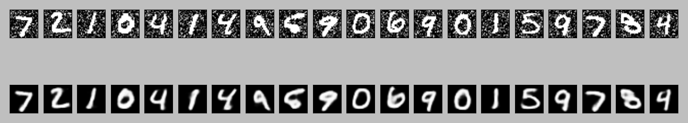

# AutoEncoderPractice
A practise session to learn autoencoder and variational autoencoder.

# Practice 1:
Noise Reduction of MNIST dataset using convolutional autoencoder.

The first row indicated the MNIST digits with some added noise. The second row is the reconstructed noise free image using autoencoder.
